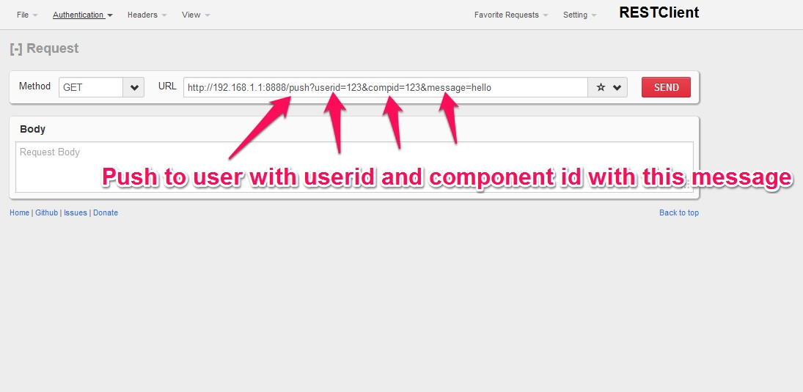
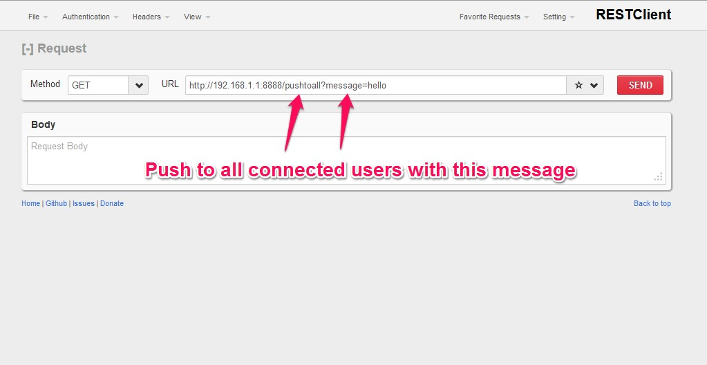

server-push
===========
There has always been problem for pushing data from server side to client side. Here is the solution using HTML 5 web sockets and python.
This is plug and play kind of websocket server which can push data to the client side(vice-versa).
Prerequisite: python tornado webserver. Install using following command in the cmd prompt
pip install tornado OR easy_install tornado

For detail see server-push.pdf

Uses
1. Pushing data from server side
2. Getting data from client side
3. Making chat application

<p>
    <strong>server-push</strong>
</p>
<p>
    There has always been problem for pushing data from server side to client side. Here is the solution using web sockets and tornado webserver(python).
</p>
<p>
    This is plug and play kind of websocket server which can push data to the client side and vice-versa.
</p>
<p>
    <strong>Prerequisite</strong>
    : tornado webserver. Install using following command in the cmd line
</p>
<div>
    <p>
        <code>pip install tornado</code>
        OR <code>easy_install tornado</code>
    </p>
</div>
<p>
    <strong><u>Step 1</u></strong>
    <u>: Run server.py on server(Now server is ready for conversation using websockets) using following cmd</u>
</p>
<div>
    <p>
        <code>python server.py</code>
    </p>
</div>
<p>
    <strong><u>Step 2</u></strong>
    <u>: Copy and paste the below code on client’s HTML page</u>
</p>
<div>
    ```javascript

            $(document).ready(function () {

                var ws;
                var host = '192.168.1.1'; //server IP
                var port = '8888'; //server port
                var uri = 'ws'; //websocket uri
                ws = new WebSocket("ws://" + host + ":" + port + uri); //create web socket object

                //Called when connection is established with server
                ws.onopen = function (evt) {
                    alert("Connection open");
                };

                //Called when message is sent from server
                ws.onmessage = function (evt) {
                    alert("message received: " + evt.data)
                };

                //Called when connection is closed from server
                ws.onclose = function (evt) {
                    alert("Connection close");
                };
            });
     
   ```
</div>
<p>
    <strong><u>Step 3</u></strong>
    <u>: Understanding server side code(server.py)</u>
</p>
<div>
    ```python
from tornado import httpserver
import tornado.websocket
import tornado.ioloop
import tornado.web
clients = []
userid = 0
class WSHandler(tornado.websocket.WebSocketHandler):
    
    #Called when attempt is made for connection from client
    def open(self):
        obj = SessionManagement()
        obj.createsession(self)#storing web socket object for further communication with client
     
    #Called when client sends message  
    def on_message(self, message):
        print 'message received %s' % userid
 
    #Called when user refreshes or closes the page
    def on_close(self):
        obj = SessionManagement()
        obj.deletesession(self)#deleting web socket object
        print 'connection closed'
class SessionManagement():
    #Create session and stores into array
    def createsession(self, obj):
        userid = obj.get_argument("userid")
        componentid = obj.get_argument("compid")
        clients.append({"wsobj":obj, "userid":userid, "compid":componentid})
        for w in clients:
            print w
    #Delete session from array when client refreshes the page or closes the page    
    def deletesession(self, obj):
        for temp in clients:
            if cmp(obj, temp['wsobj']):
                clients.remove(temp)
        for w in clients:
            print w
            
class PushToUser(tornado.web.RequestHandler):
    def get(self):
        userid = self.get_argument('userid')
        compid = self.get_argument('compid')
        message = self.get_argument('message')
        for temp in clients:
            if (temp['userid'] == userid and temp['compid'] == compid):
                temp['wsobj'].write_message(message) 
                
class PushToAll(tornado.web.RequestHandler):
    def get(self):
        message=self.get_argument('message')
        for temp in clients:
            temp['wsobj'].write_message(message)
                 
application = tornado.web.Application([
    (r'/ws', WSHandler),
    (r'/push', PushToUser), #Ex. /push?userid=123&compid=123&message=hello
    (r'/pushtoall', PushToAll), #Ex. /pushtoall?message="hello"
])
 
if __name__ == "__main__":
    http_server = tornado.httpserver.HTTPServer(application)
    http_server.listen(8888)
    tornado.ioloop.IOLoop.instance().start()


    ```
    <u>Step 4: Sending message to client using REST</u>
   
    <p>
        - Push message to specific user
    </p>
    <p>
        
    </p>
    <p>
        - Push message to all users
    </p>
    <p>
        
    </p>
    <p>
        Done!!!!!
    </p>
</div>
